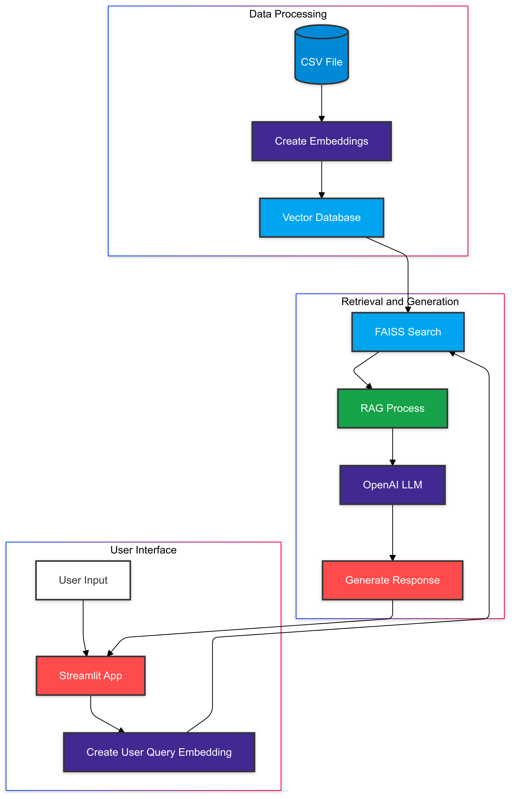

# AI-Powered Customer Support Agent

An intelligent customer support system leveraging OpenAI's language models and Azure ML for automated ticket handling and response generation.

## Overview

This project implements an AI-powered customer support agent that uses Retrieval-Augmented Generation (RAG) to provide accurate and contextual responses to customer queries. The system combines OpenAI's language models with FAISS vector database for efficient similarity search and response generation.


### Key Features

- Semantic similarity search using OpenAI embeddings and FAISS
- Automated query categorization and prioritization
- Context-aware response generation using RAG
- Interactive feedback loop for response improvement
- User-friendly Streamlit interface
- Scalable deployment on Azure ML

## Tech Stack

- **Python**: 3.10.4
- **Key Libraries**:
  - langchain & langchain-openai: For LLM integration
  - faiss-cpu: For vector similarity search
  - streamlit: For web interface
  - pandas: For data manipulation
  - openai: For API integration
- **Models**: OpenAI GPT-4 and text-embedding-3-small
- **Cloud Platform**: Azure ML

## Project Structure

```
├── Customer_Support_Training_Dataset/
│   ├── Customer_Support_Training_Dataset.csv    # Training data for the model
│   └── dataset.md                              # Dataset documentation
├── src/
│   └── helper.py                               # Core functionality and utilities
├── vector_store/
│   └── faiss_index.index                       # Pre-computed FAISS embeddings
├── analysis.ipynb                              # Data analysis and model development
├── demo.py                                     # Streamlit web application
├── requirements.txt                            # Project dependencies
└── README.md                                   # Project documentation
```

## Installation

1. Clone the repository:
```bash
git clone <repository-url>
cd customer-support-agent
```

2. Create and activate a virtual environment:
```bash
# Windows
python -m venv venv
.\venv\Scripts\activate

# Linux/Mac
python3 -m venv venv
source venv/bin/activate
```

3. Install dependencies:
```bash
pip install -r requirements.txt
```

4. Set up OpenAI API key:
```bash
# Windows
set OPENAI_API_KEY=your_api_key_here

# Linux/Mac
export OPENAI_API_KEY=your_api_key_here
```

## Usage

1. Start the Streamlit application:
```bash
streamlit run demo.py
```

2. Access the web interface at `http://localhost:8501`

3. Enter a customer query in the input field and click "Get response" to:
   - See similar queries from the training dataset
   - Get query urgency rating (1-5)
   - Receive query categorization
   - View AI-generated response

4. Provide feedback to improve responses through the feedback loop

## Development

To modify or extend the project:

1. Analyze data and experiment with models in `analysis.ipynb`
2. Update core functions in `src/helper.py`
3. Modify the Streamlit interface in `demo.py`

### Creating New Embeddings

To create new embeddings for additional data:

1. Add new data to the CSV file
2. Run the embedding creation script in `analysis.ipynb`
3. Save the new FAISS index to `vector_store/`

## Dataset

The project uses a customer support dataset with the following structure:
- flags: Language variation tags
- instruction: Customer queries
- category: High-level semantic categories
- intent: Specific query intents
- response: Example responses

Detailed dataset documentation is available in `dataset.md`.

## Contributing

1. Fork the repository
2. Create a feature branch
3. Commit your changes
4. Push to the branch
5. Create a Pull Request

## License

This project is licensed under the MIT License - see the LICENSE file for details.

## Acknowledgments

- OpenAI for providing the language models
- Azure ML for the cloud infrastructure
- Bitext Innovations for the training dataset